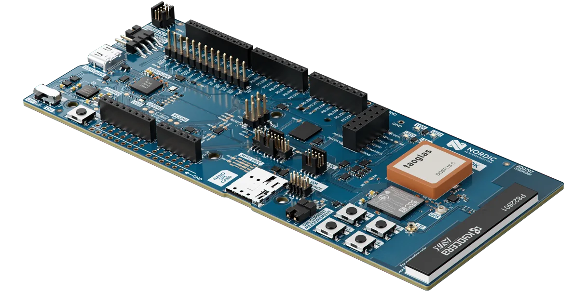

# nRF9151-dk-mender

This is an Mender-MCU integration sample for [nRF9151 DK](https://www.nordicsemi.com/Products/Development-hardware/nRF9151-DK).

This project is based on [nRF Connect](https://github.com/nrfconnect) and hardware from [Nordic Semiconductor](https://www.nordicsemi.com/)

The project is not intended to be a complete reference design for a commercial product, but rather a source of inspiration.

## Hardware

Hardware used in this project:

* [nRF9151 DK](https://www.nordicsemi.com/Products/Development-hardware/nRF9151-DK)

<p align="center">
  
</p>

You also need:

* USB-C cable
* SIM card with data plan

## Prerequisites

* Install [nRF Util](https://docs.nordicsemi.com/bundle/nrfutil/page/guides/installing.html)
* [Mender account](https://eu.hosted.mender.io/ui/signup)

## Getting Started

Before getting started, make sure you have a proper nRF Connect development environment.

### Install nRF Connect SDK

```
nrfutil install sdk-manager
```

### Install v3.2.1 SDK

```
nrfutil sdk-manager install v3.2.1
```

### Start the nRF Connect SDK toolchain shell

Use `nrfutil` to launch a shell with the correct nRF Connect SDK toolchain
environment:

```bash
nrfutil sdk-manager toolchain launch --ncs-version v3.2.1 --shell
```

If the command succeeds, your shell prompt will change to something like:

```bash
(v3.2.1) [user@host ~]$
```

All remaining commands in this guide should be run inside that shell.

### Set up workspace

Create a new workspace and enter it:

```bash
mkdir -p ~/src/nrf9151-dk-mender-workspace && cd ~/src/nrf9151-dk-mender-workspace
```

Initialize the workspace:

```bash
west init -m https://github.com/id8-engineering/nrf9151-dk-mender --mr main .
```

Change into the project directory:

```bash
cd nrf9151-dk-mender
```

Fetch and check out sources:

```bash
west update
```

### Build and flash firmware

Export Mender tentant token:

```bash
export MENDER_TENANT_TOKEN="< paste token here, from https://eu.hosted.mender.io/ui/settings/organization >"
```

Build application:

```bash
west build -p always -b nrf9151dk/nrf9151/ns app -- \
  "-Dapp_CONFIG_MENDER_SERVER_TENANT_TOKEN=\"${MENDER_TENANT_TOKEN}\""
```

You can find the Mender Artifact at:

* `build/app/zephyr/zephyr.mender`

Upload this file to https://eu.hosted.mender.io/ui/software for OTA updates.


Flash firmware:

```bash
west flash
```

### Access console

You can use any serial monitor to debug

```bash
minicom -D /dev/ttyACM0 -b 115200
```

Example startup log:

>```bash
>*** Booting MCUboot v2.3.0-dev-0d9411f5dda3 ***
>*** Using nRF Connect SDK v3.2.1-d8887f6f32df ***
>*** Using Zephyr OS v4.2.99-ec78104f1569 ***
>I: Starting bootloader
>I: Primary image: magic=good, swap_type=0x2, copy_done=0x1, image_ok=0x1
>I: Secondary image: magic=unset, swap_type=0x1, copy_done=0x3, image_ok=0x3
>I: Boot source: none
>I: Image index: 0, Swap type: none
>I: Bootloader chainload address offset: 0x10000
>I: Image version: v0.0.0
>�*** Booting nRF Connect SDK v3.2.1-d8887f6f32df ***
>*** Using Zephyr OS v4.2.99-ec78104f1569 ***
>[00:00:00.255,645] <inf> main: Starting LTE
>[00:00:12.127,532] <inf> main: LTE connected
>[00:00:12.127,593] <inf> mender: Device type: [nrf9151-dk-mender]
>[00:00:12.131,286] <inf> main: Mender activated
>[00:00:12.131,317] <inf> main:  V0.1
>[00:00:12.132,141] <inf> mender: Initialization done
>[00:00:12.132,171] <inf> mender: Checking for deployment...
>```
